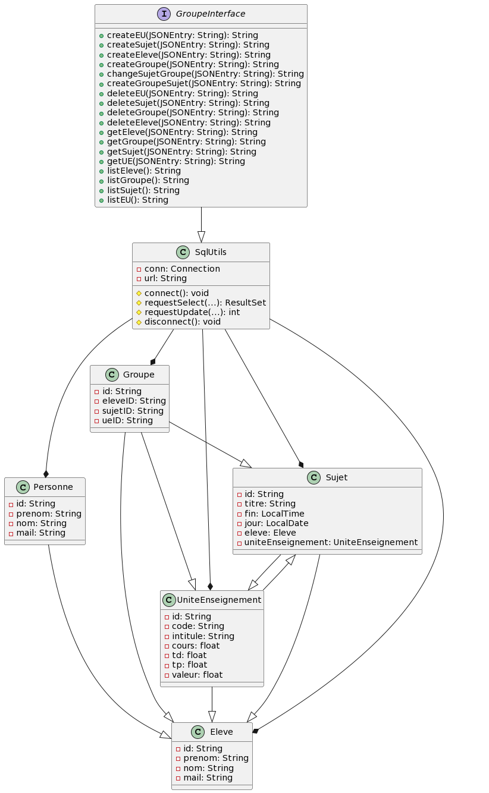
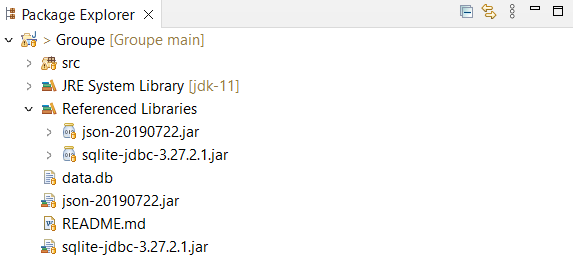
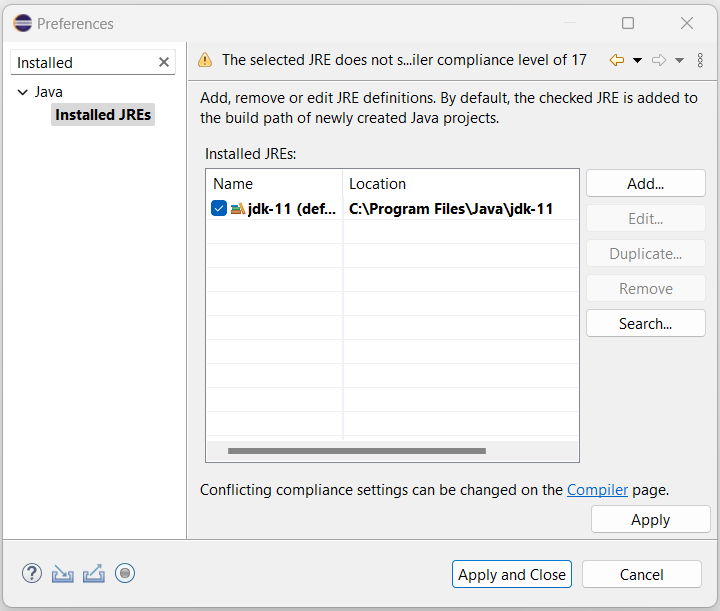
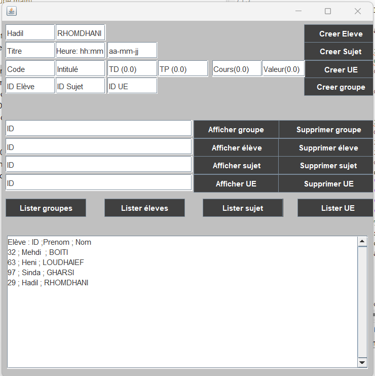

# Groupe
Groupe
# Architecture
## Class diagram

## Functional Requirements 
| ID         | Satisfied | Unsatisfied |
|------------|-----------|-------------|
| Req-gro-01 |     X     |             |
| Req-gro-02 |     X     |             |
| Req-gro-03 |     X     |             |
| Req-gro-04 |     X     |             |
| Req-gro-05 |     X     |             |
| Req-gro-06 |     X     |             |
| Req-gro-07 |     X     |             |
| Req-gro-08 |     X     |             |
| Req-gro-09 |           |      X      |
| Req-gro-10 |           |      X      |

# Besoin fonctionnels
- L'utilisateur peut créer une Unité d'Enseignement.
- L'utilisateur peut supprimer une Unité d'Enseignement.
- L'utilisateur peut créer un élève.
- L'utilisateur peut supprimer un élève. 
- L'utilisateur peut créer un sujet.
- L'utilisateur peut supprimer un sujet.
- L'utilisateur peut créer un groupe (UE – élèves – sujet)
- L'utilisateur peut supprimer un groupe (UE – élèves – sujet)
- L'utilisateur peut créer aléatoirement des groupes pour un ensemble d'élèves. 
- L'utilisateur peut changer un élève de groupe.

# Besoin non fonctionnels
- Req-doc-01 : La documentation doit décrire la procédure d'installation de la version binaire du système.
- Req-doc-02 : La documentation doit décrire la procédure de désinstallation de la version binaire du système.
- Req-doc-03 : La documentation doit décrire les interfaces de chaque composant.
- Req-doc-04 : La documentation doit décrire l'environnement matériel nécessaire à l'installation du système.
- Req-doc-05 : La documentation doit décrire l'environnement logiciel nécessaire à l'installation du système.
- Req-doc-06 : La documentation doit décrire le cheminement des appels de fonctions pour 2 fonctionnalités.
- Req-doc-07 La documentation doit lister les exigences satisfaites.
- Req-doc-08 : La documentation doit lister les exigences non satisfaites.
- Req-doc-09 : La documentation doit lister les anomalies.
- Req-doc-10 : La documentation doit décrire la procédure de compilation, depuis la récupération du code source jusqu’à la production du système packagé.
- Req-doc-11 : La documentation doit présenter la ou les vues définies dans le cadre d’architecture CASH.
- Req-exp-01 : Le système doit fonctionner sous Linux.
- Req-exp-02 : Le système doit fonctionner sous Windows.
- Req-exp-03 : Le système doit fonctionner sous Mac OS.
- Req-exp-04 : Le système doit être développé en Java 11
- Req-liv-01 : La livraison doit contenir tous les éléments nécessaires à la génération de la version binaire (hors IDE ou dépendances chargées automatiquement, par Maven par exemple).
- Req-liv-02 : La livraison doit contenir la version binaire du système.
- Req-liv-03 : La livraison doit contenir toute la documentation.
- Req-arc-01 : Le système à l’exécution est constitué d'un seul processus.
- Req-arc-02 : Le programme principal instancie deux objets : l'un implémentant l'IHM et l'autre exposant les fonctionnalités.
- Req-arc-03 : Les communications entre IHM et fonctions passent par une interface (au sens du mot-clé) Java clairement explicitée.
- Req-arc-04 : Les opérations exposées par l'interface sont de 4 types: lecture, création, modification, suppression d'un objet.
- Req-arc-05 : Les classes implémentant l'IHM, les fonctionnalités (modèle métier) et l'application (main) sont packagées dans trois jar distincts.
- Req-arc-06:  L'identifiant des objets créés est attribuée par l'IHM.
- Req-arc-07 : Les requêtes vont uniquement du composant IHM vers je composant exposant les fonctions.
- Req-fct-01 : Après re-démarrage du système il est dans le même état qu'avant son arrêt (données).
- Req-fct-02 : L'IHM peut être mise à jour (automatiquement ou à la demande de l'utilisateur).

## Packages 
- App: App controller
- IHM: User interafce
- Groupe: implemented methods
  
## Input/output
- Input/output of every method is a string of a JSON object .

# Install
- This section is for Linux Users
## Technical requirements
- access to internet 
- have sudo privileges
- have eclipse already installed
- PC

## Installing java 11
### Check java version
before we begin begin check your java version :
````sh
java --version
# expected 
#openjdk version "11.0.20.1"
````


### Installing java 11
````sh
sudo apt update
sudo apt install openjdk-11-jdk -y
````
### Managing java versions :
````sh
sudo update-alternatives --config java
````


Choose the number associated with the **java-11-openjdk** version to use it as the default, or press ENTER to leave the current settings in place.

# Using release 
## Importing project into eclipse
### Getting and extracting archive
````sh
cd ~
https://github.com/loudhaiefheni/Groupe/archive/refs/heads/main.zip
````
### Importing project into workspace via UI 
This section is for all users (Mac Os , Linux , Windows)

1.     Click File -> Import -> from the Eclipse main menu
2.     Expand General, select **Existing Projects into Workspace**, and click Next
3.     Make sure that **Select Archive File is checked** and browse for VectorProducts.zip and browse for the ZIP file
4.     Click Finish 
### Troubleshoot
- verify build path :
make sure that `json-20190722.jar` and `sqlite-jdbc-3.27.2.1.jar` are in referenced libraries as the picture below : 



**otherwise** : 
    1. right-click on the library (`json-20190722.jar` or `sqlite-jdbc-3.27.2.1.jar`) 
    2. click build path -> add to build path 
    if the option doesn't appear click on configure build path and add manually the two jars with `add external JAR` button
- verify Java runtime environments
    1. click window -> preferences
    2. navigate to java ->installed JREs 
    3. verify tha you have the right version of jdk :

**otherwise** : refer to java 8 installation section 
- verifying if the project is using the right jre 

    1.right click on the projet -> properties
    2. choose java Build Path 
    3. you should see jre system library (java8 ..).otherwise click on add library -> jre system library -> choose the right option for your JRE -> finish
## Using Binary
### Executing Binary from eclipse 
right click on src/app/controller.java -> run as -> java application . The expected result is a window like the image below :


### Getting and executing binary from command-line
````sh
cd ~
wget https://github.com/loudhaiefheni/Groupe/archive/refs/heads/executable.jar
sudo chmod +x executable.jar
java -jar executable.jar
````
# Usage 
This section is for all users (Mac Os , Linux , Windows)

default window of the IHM : 


Once we get the binary executed we can : 
 
                • Create a « élève » adding a « Prénom » (String) and « Nom » (STRING)
                •  Create « Sujet » adding ending hours of the sujet «hh:mm» (LocalTime) and the day «aaaa-mm-jj» (LocalDate)
                • Create « une unité d’enseignement » adding « code » and «intitulé» in (STRING) and  « TD, TP, Cours , valeurs »  in ( FLOAT)
                • Create « Groupe » adding « id élève, id sujet , id d’unité d’enseignement » in (STRING)

Example Create élève:


We can also
            
            ▪ Get « élève, sujet and  EU ».     
            ▪ delete « élève, sujet and  EU ».
            ▪ Lister  « élève, sujet and  EU ».


# Afficher élève


# Supprimer élève


# Lister élève


            
            
# Anomalies 
## Non-implemented fonctionality
            ▪ créer aléatoirement des groupes pour un ensemble d'élèves.
            ▪ changer un élève de groupe
# delete Project
Right-click on the project -> delete
